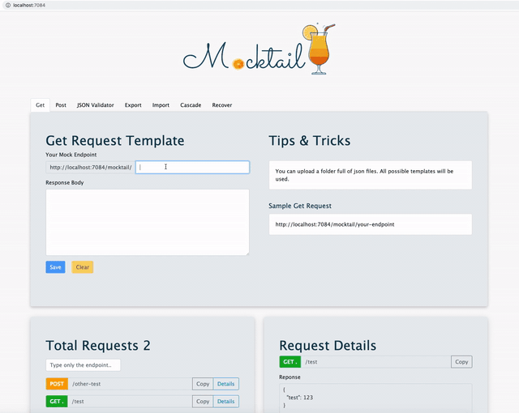

# Mocktail V2 is almost here !

# New Version Keynotes:

- [x] NodeJS replaced with Go Fiber.
- [x] React Upgrade
- [x] Containerize Mocktail
- [ ] Update Readme
- [ ] Build Scripts (GitHub Actions)
- [ ] Generate Deployment scripts.
   - [ ] Docker
   - [ ] Kubernetes
   - [ ] Kubernetes (Helm)

## Long Run

- [ ] Multiple DB Support
- [ ] Graphql support

- NodeJS replaced with Go Fiber.
- UI will be upgraded.
- Deployment scripts will be updated.
- Helm support.


# Long Run

- Mocking PUT - DELETE requests
- Graphql support
- Multiple DB support (SQLite, Postgre, Mongo)
---


----

# Mocktail  


### Mocktail is completely free, lightweight ready to run dockerized mock server with a nice interface. There are no limitations or restrictions unlike most mock servers. You can create single/multiple get & post request templates at once. Templates can be exported and easily distributed. Learn more on  [Capabilities](#capabilities) and [Tips](#tips) section. 

---

> Mocktail means non-alcoholic drink consisting of a mixture of fruit juices or other soft drinks. 🍎 🍏 🍊 🍋 🍇 🍍 🥭

## Prerequisites 🧱

You must have **docker** installed on the machine which **Mocktail** will run.

# Quickstart 🚀

#### Run the following command and you are all set.
```console
$ docker run -p 7080:7080 -d hhaluk/mocktail
```

#### Go to **localhost:7080**

<p align="center">
  
</p>


# Capabilities 😎

There are 7 tabs on top and two section at the bottom. 

- **Get** tab allows adding get requests.
    - Write only the endpoint you wish to call into **endpoint** input.
    - Write the response you wish to obtain when you make a get request for the endpoint you just provided.
    - There are random tips every time page is refreshed.
    - There is a full endpoint sample.
    - If you are making your requests to another machine in your local network, change localhost to device's local ip. 
```
http://<device-local-ip>:/7080
```
- **Post** tab allows adding post requests.
    - Same as Get request, additionally provide **mandatory** fields inside request object. Later you will get an exception if you do not provide same keys in your request body.
- **JSON Validator** ⚖️ Does what you expect it to do.
- **Export** 	🌐 Exports all stored mock request templates into a json file, so that you can share them with your teammates. 
- **Import** ⬇️ Place the json file or files (can be a folder full of json files) on the area and witness pure magic.
- **Cascade** ☠️ You can **delete** 🗑️ all mock request templates at once. 
- **Recover** 💊 If you are just curios and wondered what cascade can do to your requests, let's save the cat 🐈 , you can **revert** the cascade operation. 
> You can recover only if you didn't add any new mock requests. After you add a request, recover option will be off the table.  ☠️
- There is a list of available mock request items at the bottom left. A search bar is included. Type only the endpoint. 📋 **Copy** will copy full endpoint.
- View details of a mock request by clicking **details**. You can test if your endpoint works ✅ or delete it. 🗑️


# Tips ✅

- Your base url is http://localhost:7080 so make your requests to this url.
- You can publish your Mocktail on another port if your Port 7080 is occuppied by another process.
- Use same endpoint to update a mock request template.
- Whitespaces inside endpoints are automatically deleted .
- Only http requests are allowed. 
- Mocktail image is only 28 mb.
- Kill docker container, to remove everything related to Mocktail Server. Zero mess. Pretty easy.


# Warnings ⚠️

- Your data will **not** disappear if you quit docker. You can restart your container later.
- If you somehow manage to break the application, please open a ticket. 


# Troubleshooting 🔫

Use following commands to restart your stopped docker container.

```console
$ docker container ls -a
```

expected output:

```console
CONTAINER ID        IMAGE                 COMMAND                  CREATED             STATUS                        PORTS                 
29b9bc61f97a        hhaluk/mocktail       "docker-entrypoint.s…"   20 hours ago        Exited (255) 23 seconds ago   0.0.0.0:7080->7080/tcp
```
> No need to use the run command after restarting your container.
```console
$ docker restart <CONTAINER-ID>
```

---
"Mocktail constantly prompts me to validate my json."
Optimal Json Object.

```json
{
  "test": 123
}
```
----


License
----

MIT

