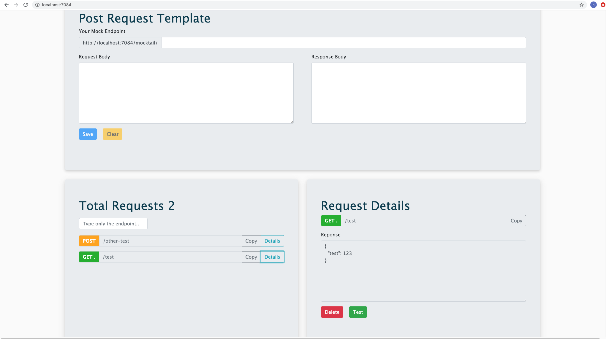

# Mocktail

### Mocktail is a totally free, ready to run dockerized local mock server with a nice interface. There are no limitations or restrictions unlike most mock servers. You can create single/multiple get & post request templates. Templates can be exported and easily distributed. Learn more on  [Capabilities](#capabilities) section. Checking [Tips](#tips) & [Rules](#rules) section will take extra 5 minutes, but it is quite useful. 

---

> Mocktail means non-alcoholic drink consisting of a mixture of fruit juices or other soft drinks. 🍎 🍏 🍊 🍋 🍇 🍍 🥭 🥥

## Prerequisites

You must have **docker** installed on the machine which **Mocktail** will run.

# Quickstart

#### Run the following command and you are all set.
```console
$ docker run -p 7084:7084 -d hhaluk/mocktail
```

#### Go to **localhost:7084**  


# Capabilities

There are 7 tabs on top and two section at the bottom. 

- **Get** tab allows adding get requests.
    - Write only the endpoint you wish to call into **endpoint** input.
    - Write the response you wish to obtain when you make a get request for the endpoint you just provided.
    - There are random tips every the page is refreshed.
    - There is a full endpoitn sample.
- **Post** tab allows adding post requests.
    - Same as Get request, additionally provide **mandatory** fields inside request object. Later you will get an exception if you do not provide same keys in your request body.
- **JSON Validator** Does what you expect it to do. ⚖️
- **Export** Exports all stored mock request templates into a json file, so that you can share them with your teammates. 
- **Import** Place the json file or files (can be a folder full of json files) on the area and witness pure magic.
- **Cascade** You can **delete** 🗑️ all mock request templates at a moment. 
- **Recover** If you are just curios and wondered what cascade can do to your requests, let's save the cat 🐈 , you can **revert** the cascade operation. 
> You can recover only if you didn't add any new mock requests. After you add a request, recover option will be off the table.  ☠️
- There is a list of available mock request items at the bottom left. A search bar is included. Type only the endpoint. 📋 Copy will copy full endpoint.
- View details of a mock request by clicking details. You can test if your endpoint works ✅ or or delete it. 🗑️




# Tips

- Your base url is http://localhost:7084 so make your requests to this url.
- Mocktail is not currently availbale from other devices in the network.
- Use same endpoint to update a mock request template.
- Whitespaces inside endpoints are automatically deleted .
- Only http requests are allowed. 


# Rules

Optimal Json Object

```json
{
"test": 123
}
```


# Upcoming Features

- Mock server will be accessible from other devices in same network


## Troubleshooting

License
----

MIT

